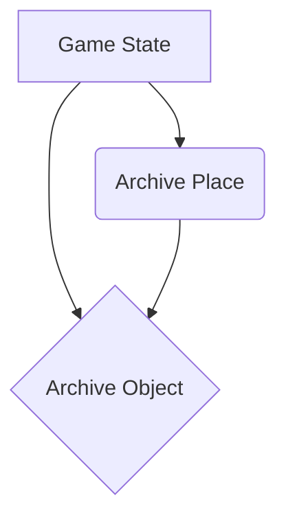

# Data Model: The Archivist's Key

This document outlines the key data entities for the interactive Prolog puzzle game, "The Archivist's Key."

## Entity Relationship Diagram

## Entities

### Game State
Represents the current state of the user's progress in the puzzle.

- **Fields**:
    - `current_location`: The current `Archive Place` of the user.
    - `found_parts`: A list of the combination parts the user has discovered.

### Archive Place
Represents a location within the virtual archive that the user can visit.

- **Fields**:
    - `name`: The unique name of the place (e.g., `office`, `library`).
    - `description`: A short description of the place.

### Archive Object
Represents an object in the game's virtual archive that can be examined. Some objects will contain parts of the combination.

- **Fields**:
    - `name`: The unique name of the object (e.g., `desk`, `book`).
    - `description`: A short description of the object.
    - `location`: The `Archive Place` where the object is located.
    - `contains`: The part of the combination this object holds, if any.
